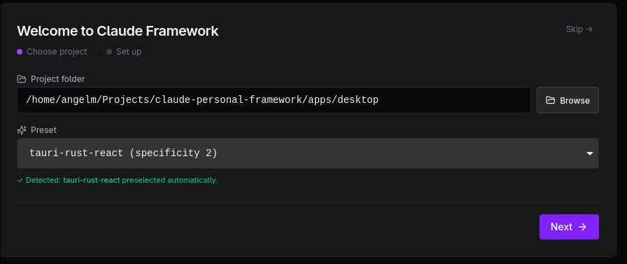
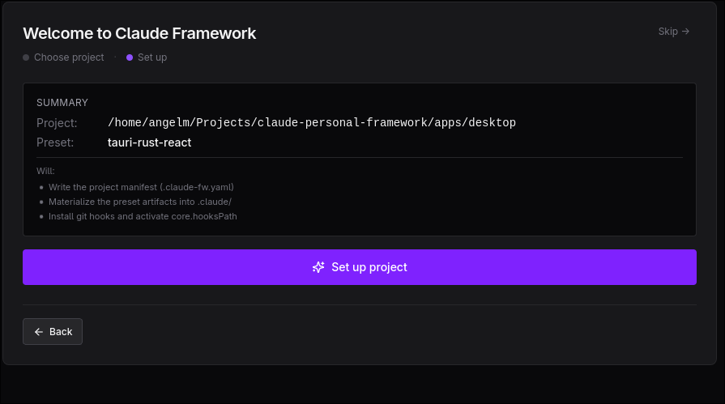
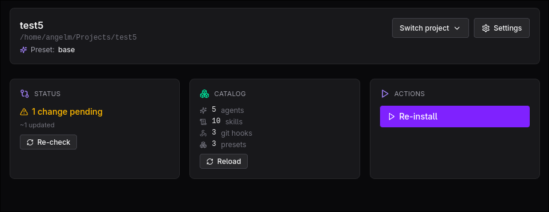
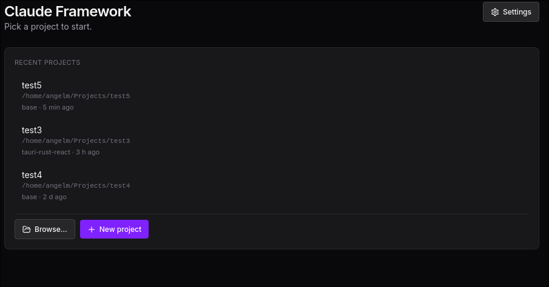
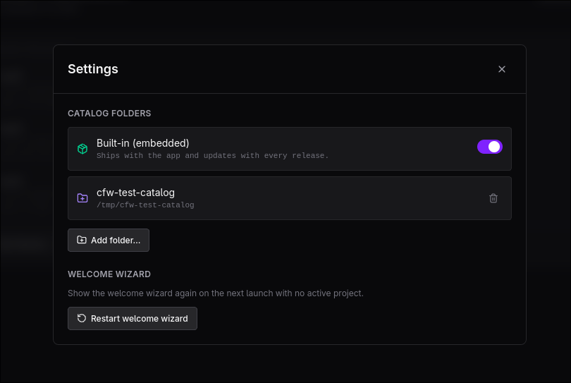

# claude-personal-framework

A personal framework for packaging reusable [Claude Code](https://docs.claude.com/en/docs/claude-code/overview)
agents, skills and commands into a versioned catalog and installing them
into any project with a single command.

Built around two ideas:

- **Compose, don't copy.** Define agents/skills/commands once. Group
  them into presets. Reuse across projects.
- **Project-level overrides.** A project can `disable`, `add` or
  `patch` any inherited artifact, so the framework adapts to projects
  that don't follow your default conventions.

## The problem this solves

After a few months using Claude Code, you accumulate agents, skills,
commands and architectural conventions that work for you. Every new
project pays the same tax: copy a dozen markdown files, edit a couple,
forget which version is the canonical one, repeat.

This framework is the answer: a single source of truth in a git repo,
a CLI that materializes the right combination into `.claude/` of any
target project, and an override mechanism so projects can deviate
without forking the catalog.

## How it works

Three layers, in increasing project-specificity:

```
┌─────────────────────────────────────────────────────────────┐
│  Catalog              presets/    agents/   skills/   commands/
│  (this repo)          base.yaml   *.md      *.md      *.md      
└─────────────────────────────────────────────────────────────┘
                                │
                                │  resolveExtends + applyOverrides
                                ▼
┌─────────────────────────────────────────────────────────────┐
│  Project manifest     .claude-fw.yaml in the target project │
│                       └ preset: <name>                      │
│                       └ overrides: [disable, add, patch]    │
└─────────────────────────────────────────────────────────────┘
                                │
                                │  claude-fw install
                                ▼
┌─────────────────────────────────────────────────────────────┐
│  Materialized output  .claude/agents, skills, commands      │
│  (gitignored)         (what Claude Code actually reads)     │
└─────────────────────────────────────────────────────────────┘
```

A **preset** declares a list of artifact ids and can extend other
presets. Resolution flattens the chain (parent ids before child ids,
deduplicated). Overrides apply on top of that resolved preset:

```yaml
# .claude-fw.yaml in a target project
preset: react-native
overrides:
  - disable: agent:hexagonal-enforcer   # work repo without hexagonal
  - add: agent:legacy-mvc-helper        # something extra
  - patch: agent:docs-manager           # different body for this repo
    content: |
      ---
      name: docs-manager
      ---
      Custom body…
```

### Idempotent installs and drift

Every `install` writes a lockfile — `.claude-fw.lock.json` — recording
the content hash of each materialized artifact. The next `install`
compares the catalog against that lockfile and applies only the
difference: new artifacts are written, changed ones updated, and
artifacts dropped from the preset are deleted. Files you placed in
`.claude/` by hand are never touched — the engine only manages what the
lockfile tracks. Re-running `install` is therefore safe and idempotent;
a file deleted by accident gets restored.

`claude-fw status` reports that same diff (added / updated / removed /
unchanged) **without writing anything** — useful before pulling a newer
version of the catalog into a project.

## Quick start

Inside this repo:

```bash
pnpm install
pnpm -r build
node packages/cli/dist/index.js install --framework . --project .
```

The last line is the framework configuring **itself**: agents declared
in `presets/base.yaml` are loaded from `agents/` and materialized
under `.claude/agents/`.

To install into another project:

```bash
cd /path/to/your/project
echo "preset: base" > .claude-fw.yaml
CLAUDE_FW_ROOT=/path/to/claude-personal-framework \
  node /path/to/claude-personal-framework/packages/cli/dist/index.js install
```

Commands: `install` materializes the preset, `list` enumerates the
catalog, `status` shows drift against the last install. All three
accept `--json` for programmatic consumers (the desktop app uses it).

(A global bin install is on the roadmap; for now invoke via `node`.)

### Run the desktop app

```bash
pnpm install
pnpm -r build
pnpm -C apps/desktop tauri:dev
```

On Linux/Wayland prepend `WEBKIT_DISABLE_DMABUF_RENDERER=1` if the
window fails to open with a GDK protocol error. See
[apps/desktop/README.md](apps/desktop/README.md) for the full setup
(stack, IPC bridge, other gotchas).

### Inside the desktop app

First-time users land on a two-step welcome wizard. The first step picks
a project folder and detects the stack against the catalog's `detects:`
rules to preselect the right preset:



The second step shows the setup summary and runs `init + install` in
sequence; if the folder is missing or not a git repo, the wizard
intercepts the typed error and offers the right native modal:



Once a project is set up, the app switches to the free mode: project
header with a Switch dropdown, plus three cards for Status / Catalog /
Actions. Outcomes are ephemeral — success banners auto-dismiss after
5 s, errors stay sticky:



When the welcome flag is set and there's no active project, the recent
projects screen replaces the wizard:



Settings is a full-screen modal that manages the catalog sources —
built-in toggle, user folders with per-row remove, and an Add folder
button that validates against the engine before persisting. The
welcome wizard can be reset from the bottom section:



## Architecture

Hexagonal (ports & adapters):

```
packages/core/src/
├── domain/              ← entities, value objects, domain services
│   ├── model/           Agent, Skill, Command, Preset, Composition,
│   │                    ContentHash, Override, Settings, ids,
│   │                    artifact-summary, Lockfile, DriftReport
│   ├── errors/          DomainError + typed subclasses
│   └── services/        resolveExtends, applyOverrides, computeDrift
├── application/         ← use cases + ports + shared services
│   ├── ports/           CatalogPort, WriterPort, LockfileStorePort
│   ├── services/        buildComposition (shared by install + status)
│   └── use-cases/
│       ├── install/         install use case (drift-aware)
│       ├── list-catalog/    listCatalog use case
│       └── check-status/    checkStatus use case (read-only)
└── infrastructure/      ← adapters that implement ports
    ├── yaml/            parsePreset, parseProjectManifest
    ├── json/            parseLockfile, serializeLockfile
    ├── markdown/        extractFrontmatterDescription
    └── fs/              CatalogReader, ClaudeWriter, LockfileStore

packages/cli/            ← CLI port over the same engine
└── src/                 install + list + status commands, --json flag

apps/desktop/            ← Tauri desktop port over the same engine
├── src/                 React 19 + Vite + Tailwind 4
└── src-tauri/           Rust handlers that spawn the CLI as subprocess
```

The domain has zero filesystem or framework imports. Adapters depend
inward on the domain. CLI and the desktop app are two independent
ports over the same use cases — the desktop app does not reimplement
the engine, it spawns the CLI in a subprocess and consumes its
structured JSON output.

## Project layout

```
.
├── agents/              Catalog: source of truth for agents
├── skills/              Catalog: nestjs-hexagonal-patterns
├── commands/            (empty for now)
├── presets/             Catalog: preset YAMLs
│   ├── base.yaml
│   └── nestjs.yaml
├── packages/
│   ├── core/            Engine: domain + application + infrastructure
│   └── cli/             CLI port
├── apps/
│   └── desktop/         Tauri desktop port (React + Rust)
├── docs/
│   └── adr/             Architecture Decision Records
├── .claude/             Output of `claude-fw install` (gitignored)
├── .claude-fw.yaml      Project manifest (this repo configures itself)
└── .claude-fw.lock.json Lockfile: content hashes of the last install
```

## Status

- ✅ Domain model + composition resolver (extends chains, diamond
  inheritance, cycle detection)
- ✅ YAML + JSON + filesystem adapters
- ✅ Install / list-catalog / check-status use cases with
  content-hashed entities
- ✅ CLI `claude-fw install`, `list`, `status`, all with `--json`
- ✅ Lockfile-based drift: idempotent installs, `status` reports
  added / updated / removed / unchanged without writing
- ✅ Self-hosting: this repo's own `.claude/` is materialized by the
  engine
- ✅ Tauri desktop app with catalog browser and drift view
  (see [apps/desktop/README.md](apps/desktop/README.md))
- ✅ NestJS preset with `hexagonal-refactor-nestjs` agent, validated
  on a real client project
- 🚧 `overrides:` field in Preset schema (ADR 0001)
- 🚧 Provider-agnostic `pr-creator` (ADR 0001)
- 🚧 Global bin install (`npm i -g`)
- 🚧 Sidecar bundling Node + CLI inside the desktop binary

## Architectural decisions

Recorded in [`docs/adr/`](docs/adr/). Each record captures the
context, the options considered (including the rejected ones), the
decision and its consequences.

## Development

```bash
pnpm install              # install deps
pnpm -r test              # run tests
pnpm -r build             # type-check + emit dist/
pnpm lint                 # biome check
pnpm check                # biome check --write (fix formatting)
```

For the desktop app specifically, see
[apps/desktop/README.md](apps/desktop/README.md) — there is a Linux/Wayland
environment variable that may be required.

TypeScript strict (`noUncheckedIndexedAccess`,
`exactOptionalPropertyTypes`, `verbatimModuleSyntax`). Biome for lint
+ format. Vitest for tests on the engine.
